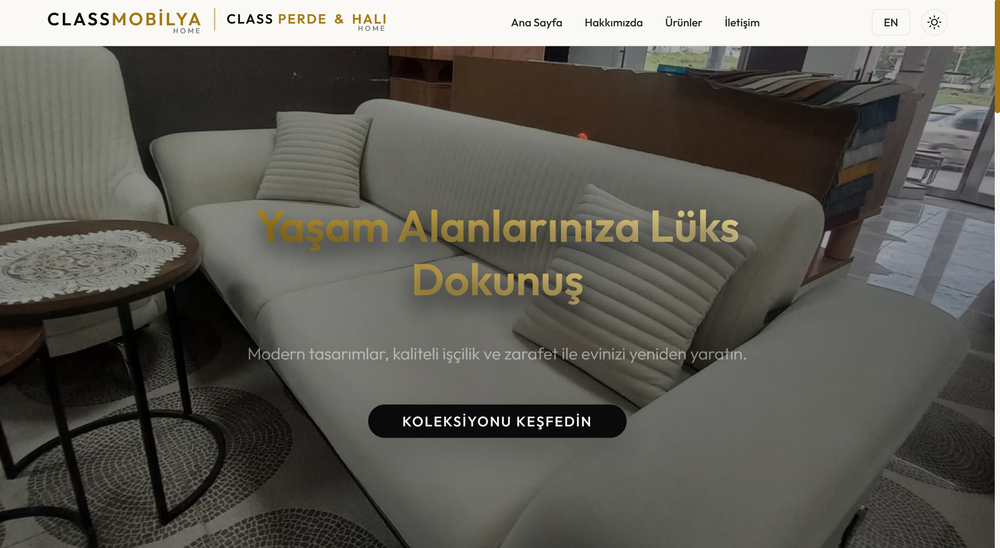
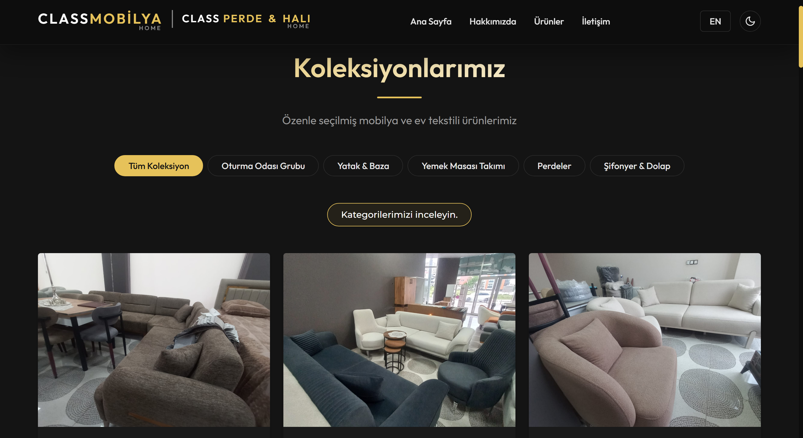
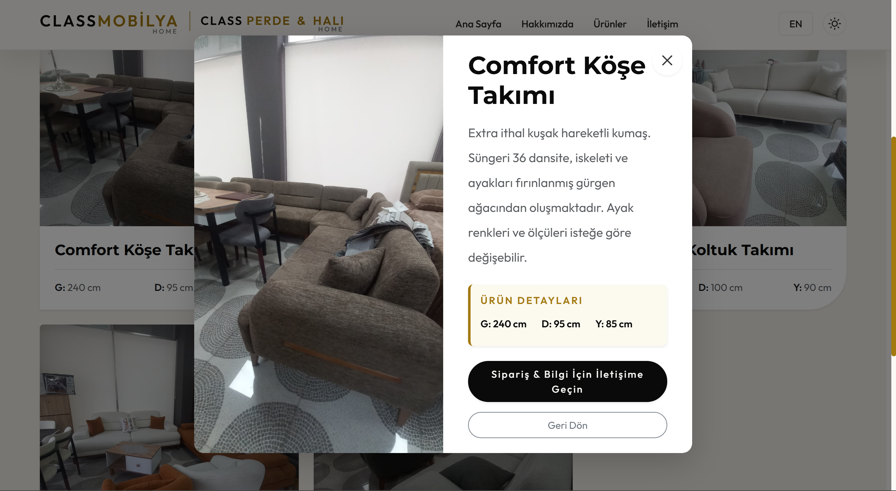

# CLASSMOBİLYA HOME - Final Projesi

Bu proje, bir üniversite final ödevi kapsamında geliştirilmiş olan gerçek bir küçük işletme web sitesidir. 

## Proje Tanımı ve Müşteri Bilgisi
**Müşteri:** CLASSMOBİLYA HOME & CLASS PERDE
**Sektör:** Mobilya ve Ev Tekstili
**Amaç:** İşletmenin ürünlerini (Koltuklar, Perdeler, Yatak, Dolap, Yemek Masası) dijital ortamda şık, modern ve erişilebilir bir web sitesi üzerinden sergilemek ve potansiyel müşterilerin iletişim formu ile mağazaya ulaşmasını sağlamak.

## Kullanılan Teknolojiler
- **HTML5:** Semantik etiketler (`header`, `nav`, `main`, `section`, `footer`) ile tamamen erişilebilir (WCAG AA) bir yapı kuruldu.
- **CSS3 & Bootstrap 5:** Flexbox ve Grid sistemleri kullanılarak %100 responsive (Mobil, Tablet, Masaüstü) bir yerleşim sağlandı. Asimetrik şekiller (asymmetric border-radius), altın renk geçişleri (gradients) ve kaydırma efektleri ile "özgün ve ilginç" bir lüks tasarımı uygulandı.
- **JavaScript (ES6):** Vanilla JS kullanılarak Karanlık Mod (Dark Mode), Çoklu Dil (TR/EN) geçişi, Dinamik Ürün Filtreleme, Scroll Reveal (aşağı kaydırdıkça belirme) efektleri ve tam ekran Modal pencereleri kodlandı. Bütün değişken adları tamamen Türkçe kullanıldı.
- **Araçlar:** OpenCode ve Google Antigravity, Google Analytics (ziyaretçi takibi için) ve Formspree (çalışan iletişim formu için).

## Klasör Yapısı
- `css/` : CSS stil dosyalarını (style.css) barındırır.
- `js/` : JavaScript dosyalarını (script.js) barındırır.
- `fotograflar/` : Sitenin optimize edilmiş ürün görsellerini ve faviconu barındırır.
- `index.html` : Ana sayfa ve kategoriler.
- `urunler.html` : Ürün filtreleme galerisi ve detay sayfası.

## Canlı Site Bağlantısı
Site GitHub Pages üzerinden canlıya alınmıştır. (HTTPS / SSL Sertifikalı)
https://elifkaner.github.io/ClassMobilya-Perde-Final/

## Öne Çıkan Özellikler (Final Kriterleri)
1. **Responsive & Semantik:** Tamamen mobil uyumlu ve anlamsal kodlama.
2. **Karanlık/Aydınlık Mod:** Kullanıcı tercihine göre değişen temalar.
3. **Çoklu Dil (TR/EN):** Sayfa yenilenmeden çalışan dil geçiş sistemi.
4. **Erişilebilirlik:** Lighthouse üzerinde >90 puan hedeflenmiş (Alt etiketleri, kontrast, aria-label, skip-link).
5. **SEO Optimizasyonu:** Meta description, düzgün Heading (H1-H6) yapısı ve Open Graph sosyal medya etiketleri.
6. **Form ve Etkileşim:** Formspree ile çalışan iletişim formu, modal popup ve sayfa içi animasyonlar.

## Ekran Görüntüleri

### Ana Sayfa Görünümü

### Karanlık Mod Görünümü

### Ürünler ve Modal Penceresi Görünümü

